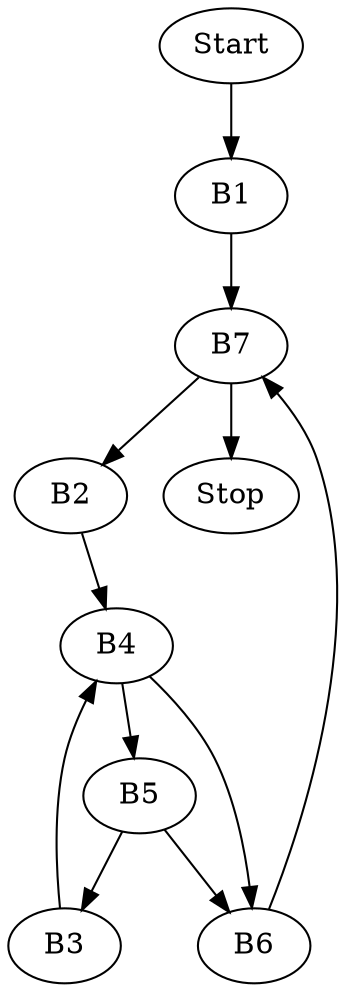

## Zadanie 7


### Kod w C
```c=
void insertion_sort(int arr[], int length) {
    int j, temp;
    for(int i = 0; i < length; i++) {
        j=i;
        while( j > 0 && arr[j] < arr[j-1]) {
            temp = arr[j];
            arr[j] = arr[j-1]
            arr[j-1] = temp;
            j--;
        }
    }
}
```

### Kod trójkowy i bloki podstawowe

```c=
        i := 0                    ;<<B1>>
        goto Icond				  
Iloop:  j := i                    ;<<B2>>
        goto Jcond
Jloop:  t1 := j * 4	              ;<<B3>>
        temp := arr[t1]
        t2 := j - 1
        t3 := t2 * 4
        arr[j1] := arr[t3]
        arr[t3] := temp
        j := j - 1
Jcond:  t4 := j <= 0		      ;<<B4>>
        if t4 goto Iplus
        t5 := j * 4		          ;<<B5>>
        t6 := arr[t5]
        t7 := j - 1
        t8 := t7 * 4
        t9 := arr[t8]
        t10 := t6 < t9
	    if t10 goto Jloop
Iplus:  i := i + 1                ;<<B6>>
Icond:  if i < length goto Iloop  ;<<B7>>
```

### Graf przepływu sterowania

