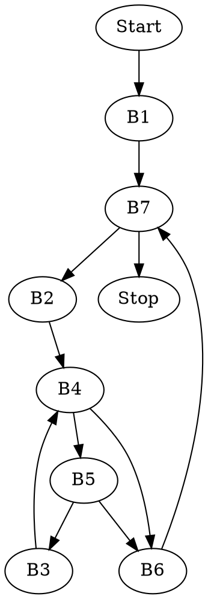

# ASK -- Lista 1

###### tags: `ASK`

## Zadanie 1

```c=
uint32_t copy_bit(uint32_t x, uint32_t i, uint32_t k) {
    return (x & ~(1 << k)) | ( ((1 << i) & x) << (k - i) );
}
```

## Zadanie 2

```c=
uint32_t popcount(uint32_t x) {
    x = (0x55555555 & x) + ((x >> 1) & 0x55555555);
    x = (0x33333333 & x) + ((x >> 2) & 0x33333333);
    x = (0x0F0F0F0F & x) + ((x >> 4) & 0x0F0F0F0F);
    x = (0x00FF00FF & x) + ((x >> 8) & 0x00FF00FF);
    return (0x0000FFFF & x) + ((x >> 16) & 0x0000FFFF);
}
```

## Zadanie 3

### Jak dane układane są w pamięci?
* adresy zmiennych o typie prymitywnym muszą być 
  wielokrotnością ich rozmiaru.
* struktura musi kończyć się na adresie będącym
  wielokrotnością rozmiaru jej największej składowej.
```c=
struct A
{
    int8_t a; // 1B, pozycja p
    // [3B padding], bo void* musi być na wielokrotności 4
    void *b; // 4B, pozycja p+4
    int8_t c; // 1B, pozycja p+8
    // [1B padding], bo int16, busi być na wielokrotności 2
    int16_t d; // 2B, pozycja p+10
    // Łącznie 12B, brak paddingu na końcu, bo to wielokrotność 4
};
```

### Jak układać wydajniej? 
 
Od największej do najmniejszej. Wtedy miejsce zajmowane przez większe struktury zawsze będzie się kończyło na adresie podzielnym przez mniejsze, czyli nie będzie wewnętrznych paddingów.

```c=
struct Better_A
{
    void *b; // 4B, pozycja p
    int16_t d; // 2B, pozycja p+4
    int8_t a; // 1B, pozycja p+6
    int8_t c; // 1B, poztja p+7
    // Łącznie 8B, brak paddingu na końcu, bo to wielokrotność 4
};

struct B {
    uint16_t a; // 2B, pozycja p
    // [6B padding], bo double musi być na wielokrotności 8
    double b; // 8B, pozycja p+8
    void *c; //4B, pozycja p+16
    // [4B padding], bo struktura musi się kończyć na wielokrotności 8
    // Łączneie 24B
};

struct Better_B {
    double b; // 8B, pozycja p
    void *c; //4B, pozycja p+8
    uint16_t a; // 2B, pozycja p+12
    // [4B padding], bo struktura musi się kończyć na wielokrotności 8
    // Łączneie 16B
};
```

## Zadanie 4

**volatile** - jest to modyfikator typu, który informuje kompilator o tym, że stan zmiennej może być zmieniany przez zewnętrzne programy. Czyli na przykład nie może zostać usunięta, lub zastąpiona w programie, który nigdzie nie modyfikuje jej stanu.

**static** (zmienne lokalne i procedury) - pozwala na utrwalenie wartości zmiennej pomiędzy wowołaniami procedury.

**static** (zmienne globalne) - ogranicza widoczność zmiennej wyłącznie do pliku w którym znajduje się jej deklaracja.

**restrict** - zastosowane go w stosunku do wskaźnika, zapewnia kompilator, że wskaźnik ten jest jedynym wskazującym na jego komórkę pamięci (i jej pochodne). Pozwala to na wykonanie przez kompilator pewnych optymalizacji, jednak odpowiedzialność za dopilnowanie prawdziwości tego założenia wciąż leży po stronie programisty.

## Zadanie 5

### Przykład pierwszy
#### Kod w C
```c=
s += b[j+1] + b[--j];
```
#### Kod trójkowy
```c=
t1 := j + 1
t2 := t1 * 4
t3 := b[t2]
s  := s + t3
t4 := j - 1
t5 := t4 * 4
t6 := b[t4]
s  := s + t6
```

## Przykład drugi

### Kod w C
```c=
a[i++] -= *b * (c[j*2] + 1);
```
### Kod trójkowy
```c=
t1 := i * 4
t2 :=  a[t1]
t2 := *b
t3 := j * 2
t4 := t3 * 4
t5 := c[t4]
t6 := t5 + 1
t7 := t2 * t6
a[t1] := t2 - t7
i := i + 1
```

## Zadanie 7


### Kod w C
```c=
void insertion_sort(int arr[], int length) {
    int j, temp;
    for(int i = 0; i < length; i++) {
        j=i;
        while( j > 0 && arr[j] < arr[j-1]) {
            temp = arr[j];
            arr[j] = arr[j-1]
            arr[j-1] = temp;
            j--;
        }
    }
}
```

### Kod trójkowy i bloki podstawowe

```c=
        i := 0                    ;<<B1>>
        goto Icond				  
Iloop:  j := i                    ;<<B2>>
        goto Jcond
Jloop:  t1 := j * 4	           ;<<B3>>
        temp := arr[t1]
        t2 := j - 1
        t3 := t2 * 4
        arr[j1] := arr[t3]
        arr[t3] := temp
        j := j - 1
Jcond:  t4 := j <= 0		   ;<<B4>>
        if t4 goto Iplus
        t5 := j * 4		   ;<<B5>>
        t6 := arr[t5]
        t7 := j - 1
        t8 := t7 * 4
        t9 := arr[t8]
        t10 := t6 < t9
	if t10 goto Jloop
Iplus:  i := i + 1                ;<<B6>>
Icond:  if i < length goto Iloop  ;<<B7>>
```

### Graf przepływu sterowania



## Zadanie 8

### Wstęp

Wyobraźmy sobie, że chcemy skopiować w pętli niepustą tablicę, której liczba elementów jest podzielna przez 8.

#### Najprostsze podejście

```c=
void simple(uint8_t *to, uint8_t* from, size_t count) {
    do {
        *to++ = *from++;
    } while(--count > 0);
}
```

Możemy jednak skorzystać z tego, że liczba elementów jest podzielna przez 8 i wykonywać po 8 kopiowań w jednym obrocie pętli, wtedy zaoszczędzimy wielokrotne, niepotrzebne sprawdzanie warunku.

#### Lepsze podejście

```c=
void better(uint8_t *to, uint8_t* from, size_t count) {
    int n = count / 8;
    do {
        *to++ = *from++;
        *to++ = *from++;
        *to++ = *from++;
        *to++ = *from++;
        *to++ = *from++;
        *to++ = *from++;
        *to++ = *from++;
        *to++ = *from++;
    } while(--n > 0);
}
```

Jak uogólnić takie rozwinięcie pętli na dowolną liczbę bajtów? Wykonać najpierw modulo 8 takich operacji, a później analogicznie do powyższego sposobu, już dla podzielnej przez 8 liczby elementów.

#### Podejście z zadania

```c=
void secret(uint8_t *to, uint8_t* from, size_t count)
{
    size_t n = (count+7) / 8;
    switch(count%8)
    {
       case 0: do { *to++ = *from++;
       case 7:      *to++ = *from++;
       case 6:      *to++ = *from++;
       case 5:      *to++ = *from++;
       case 4:      *to++ = *from++;
       case 3:      *to++ = *from++;
       case 2:      *to++ = *from++;
       case 1:      *to++ = *from++;
                  } while (--n>0);
    }
}
```

### Zapis za pomocą goto

```c=
void secret_goto(uint8_t *to, uint8_t* from, size_t count)
{
    static void* labels[] = { &&label0, &&label1, &&label2, &&label3, &&label4, &&label5, &&label6, &&label7 };
    size_t n = (count + 7) / 8;

    goto *labels[count % 8];

    label0:      *to++ = *from++;
    label7:      *to++ = *from++;
    label6:      *to++ = *from++;
    label5:      *to++ = *from++;
    label4:      *to++ = *from++;
    label3:      *to++ = *from++;
    label2:      *to++ = *from++;
    label1:      *to++ = *from++;

    if(--n > 0) goto label0;
}
```

## Zadanie 6

Dla przypomnienia
```c=
struct A
{
    int8_t a; // 1B, pozycja p
    // [3B padding], bo void* musi być na wielokrotności 4
    void *b; // 4B, pozycja p+4
    int8_t c; // 1B, pozycja p+8
    // [1B padding], bo int16, busi być na wielokrotności 2
    int16_t d; // 2B, pozycja p+10
    // Łącznie 12B, brak paddingu na końcu, bo to wielokrotność 4
};
```
### Kod w C
```c=
vs->d = us[1].a + us[j].c
```
### Kod trójkowy
```c=
t1 := us + 12
t2 := *t1
t3 := j * 12
t3 := t3 + 8
t4 := us + t3 
t5 := *t4
t7 := vs + 10
*t7 := t2 + t5
```


