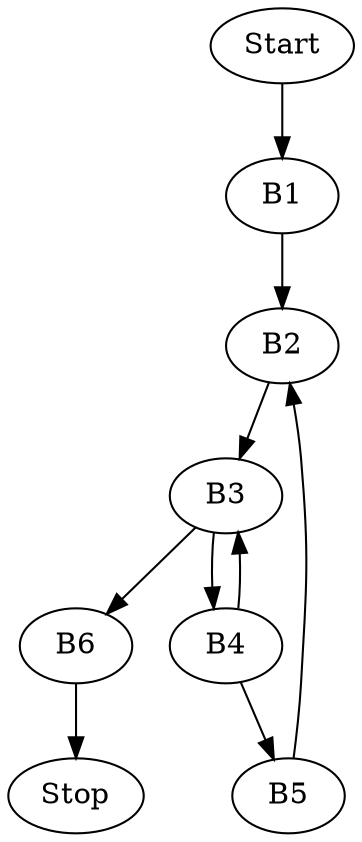
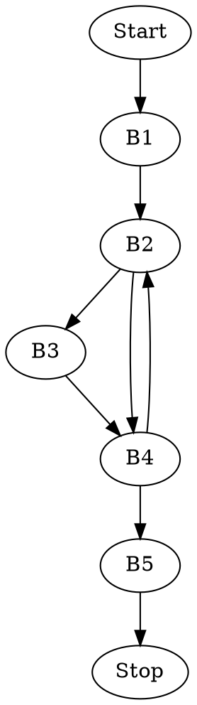
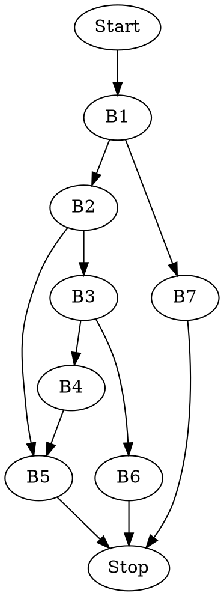

# ASK -- Lista 5

###### tags: `ASK`

## Zadanie 1

Zgodnie z *System V ABI* argumenty funkcji będą dane w rejestrach:

* `EDI` -- argument `x`
* `ESI` -- argument `n`

Zwracamy wynik przez rejest `EAX`.

### Podany kod asemblera

```whatever=
puzzle: 	testl %esi, %esi 	#jeśli n == 0 to ZF = 1
		je .L4			#jeśli n było zerem skocz do L4
		xorl %edx, %edx	#wyzerowanie edx (od teraz - i)
		xorl %eax, %eax	#wyzerowanie eax (od teraz - bit_count)
.L3: 		movl %edi, %ecx	#przeniesienie x do ecx
		andl $1, %ecx		#pobranie najlżejszego bitu z x
		addl %ecx, %eax	#dodanie najlżejszego bitu do bit_count
		sarq %rdi		#przesunięcie x'a w prawo
		incl %edx		#zwiększamy i o 1
		cmpl %edx, %esi	#porównujemy i do n (jeśli nie równe to ZF=0)
		jne .L3			#jeśli i!=n (ZF=0) to skaczemy do L3 
		ret			#wpp kończymy (zwracamy bit_count)
.L4: 		movl %esi, %eax	#przenosimy n do EAX (tutaj może być tylko n=0)
		ret			#kończymy (zwracamy 0)
```

Jak widać, jest to kod funkcji liczącej liczbę zapalonych bitów `x` o długości `n` bitów, za pomocą pętli.

### Odpowiednik w C

```c=
int puzzle(long x, unsigned n){
	if(n==0) return 0;
	int bit_count = 0;
	for(int i=0; i<n; i++){
		bit_count += x & 1;
		x >>= 1;
	}
	return bit_count;
}
```

## Zadanie 2

Zgodnie z *System V ABI* argumenty funkcji będą dane w rejestrach:

* `RDI` -- argument `s`
* `RSI` -- argument `d`

Zwracamy wynik przez rejest `RAX`.

### Podany kod asemblera

```whatever=
puzzle2:	
		movq %rdi, %rax	#Kopiujemy wskaźnik s do RAX
.L3: 		movb (%rax), %r9b 	#Wyciągamy element tablicy s, zapisujemy w R9
		leaq 1(%rax), %r8 	#Obliczamy adres kolejnego elementu do R8
		movq %rsi, %rdx	#Kopiujemy wskaźnik d do RDX
.L2: 		movb (%rdx), %cl	#Kopiujemy element tablicy d, zapisujemy w CL 
		incq %rdx		#zwiększamy rdx 
		testb %cl, %cl		#sprawdzamy czy element tablicy jest zerem (NULL)
		je .L4			#jeśli jest, skaczemy do L4
		cmpb %cl, %r9b		#porównujemy element tablicy s z elementem d
		jne .L2			#jeśli były różne, skaczemy do L2
		movq %r8, %rax		#wpp. zmieniamy raxa na adres kolejnego elemntu s
		jmp .L3			# i skaczemy do L3
.L4: 		subq %rdi, %rax	#obliczamy różnicę raxa i początku tablicy s
		ret			#zwracamy tą różnicę
```

Jak widać funkcja ta zwróci największą możliwą liczbę początkowych elementów tablicy `s`, z których każdy występuje gdzieś w tablicy `d`. 


### Podział na bloki podstawowe
```whatever=
puzzle2:	
		movq %rdi, %rax	#<B1>
.L3: 		movb (%rax), %r9b	#<B2>
		leaq 1(%rax), %r8
		movq %rsi, %rdx
.L2: 		movb (%rdx), %cl	#<B3>
		incq %rdx
		testb %cl, %cl
		je .L4
		cmpb %cl, %r9b		#<B4>
		jne .L2
		movq %r8, %rax		#<B5>
		jmp .L3
.L4: 		subq %rdi, %rax	#<B6>
		ret
```
### Diagram przepływu sterowania


### Odpowiednik w C

```c=
long puzzle2(char *s, char *d){
	char *current_s = s;
	while(true){
		char *current_d = d;
		while(*current_s != *current_d){
			id(*current_d == NULL) return current_s - s;
			current_d++;
		}
		current_s++;
	}
	
}
```
## Zadanie 3

Zgodnie z *System V ABI* argumenty funkcji będą dane w rejestrach:

* `EDI` -- argument `n`
* `ESI` -- argument `d`

Zwracamy wynik przez rejestr `EAX`.

### Podany kod asemblera

```whatever=
puzzle3:
		movl %edi, %edi	#zerujemy wyższe bity
		salq $32,  %rsi	#przesuwamy d na wyższe 32 bity
		movl $32,  %edx	#zapisujemy 32 w EDX (od teraz i)
		movl $0x80000000, %ecx	#Zapisujemy jeden najwyższy zapalony bit w 
					#ecx (od teraz mask)
		xorl %eax, %eax	#zerujemy rejest EAX (od teraz result)
.L3: 		
		addq %rdi, %rdi	#n = n + n (inaczej n*=2, czy n << 1)
		movq %rdi,  %r8	#wynik przenosimy do R8
		subq %rsi,  %r8	#odejmujemy d << 32 
		js   .L2		#jeśli (n << 1) < (d << 32)  (SF=1)
		orl  %ecx, %eax	#wpp. ustawiamy jeden bit result na 1
		movq %r8,  %rdi	#n = (n << 1) - (d << 32)
.L2: 
		shrl %ecx		#przesuwamy zapalony bit w prawo
		decl %edx		#i--
		jne .L3			#jeśli  i!=0 skocz do L3
		ret			#zwróć result
```

Zgodnie ze wskazówką przetestujemy funkcję tak jak w rodziale *Mixing V and Assembly Language*.

#### puzzle3.s:
```
        .globl  puzzle3
        
        .text
puzzle3:
		movl %edi, %edi
		salq $32,  %rsi
		movl $32,  %edx
		movl $0x80000000, %ecx
		xorl %eax, %eax
.L3: 		
		addq %rdi, %rdi
		movq %rdi,  %r8
		subq %rsi,  %r8
		js   .L2
		orl  %ecx, %eax
		movq %r8,  %rdi
.L2: 
		shrl %ecx
		decl %edx
		jne .L3
		ret
		
```
#### main.c:
```c=
#include <stdio.h>
#include <inttypes.h>

int32_t puzzle3(uint32_t, int32_t);

int main() {
    printf("%d\n", puzzle3(1,1)); //1
    printf("%d\n", puzzle3(1,2)); //0
    printf("%d\n", puzzle3(2,1)); //2
    printf("%d\n", puzzle3(4,2)); //2
    printf("%d\n", puzzle3(8,4)); //2
    printf("%d\n", puzzle3(5,2)); //2
    printf("%d\n", puzzle3(7,2)); //3
    return 0;
}
```

Funkcja ta implementuje całkowite dzielenie pisemne dwóch liczb, czyli $\left\lfloor \frac{n}{d} \right\rfloor$.

##### Przykład

$\left\lfloor \frac{4}{2} \right\rfloor$ na liczbach 4 bitowych.
$n = 4$
$d = 2$
```
0000 0100 ( n ) 
0010 0000 ( d << 4 )

Przesuwamy w prawo n aż się nie zmieści w d (to samo co przesuwanie w lewo
d aż się zmieści w n w normalnym dzieleniu pisemym)

0000 1000 ( n ) 
0010 0000 ( d << 4 )
0 ( result )

0001 0000 ( n ) 
0010 0000 ( d << 4 )
00 ( result )

0010 0000 ( n ) 
0010 0000 ( d << 4 )
001 ( result )

0000 0000 ( n ) 
0010 0000 ( d << 4 )
0010 ( result )
```

### Podział na bloki podstawowe

```
puzzle3:
		movl %edi, %edi		<B1>
		salq $32,  %rsi
		movl $32,  %edx
		movl $0x80000000, %ecx
		xorl %eax, %eax
.L3: 		
		addq %rdi, %rdi		<B2>
		movq %rdi,  %r8
		subq %rsi,  %r8
		js   .L2
		orl  %ecx, %eax		<B3>
		movq %r8,  %rdi
.L2: 
		shrl %ecx			<B4>
		decl %edx
		jne .L3
		ret				<B5>
```

### Diagram przepływu sterowania



### Odpowiednik kodu w języku C

```c=
uint32_t puzzle3(uint32_t n, uint32_t d){
	uint64_t numerator = n;
	uint64_t denominator = (uint64_t)d << 32;
	uint32_t mask = 0x80000000;
	uint32_t result = 0;
	
	for(int i=32; i > 0; i--){
        numerator*=2;
		if(numerator >= denominator){
			result |= mask;
			numerator = numerator - denominator;
		}
		mask >>= 1;
	}
    return result;
}
```

## Zadanie 5

Zgodnie z *System V ABI* argumenty funkcji będą dane w rejestrach:

* `RDI` -- argument `x`
* `RSI` -- argument `n`

Zwracamy wynik przez rejestr `EAX`.

Mamy podaną tablicę skoków, w których umieszczone są adresy pod które będziemy skakać, przypiszmy im etykiety i zaznaczmy w kodzie. Skakać będziemy istrukcją `jmpq *0x4006f8(,%rsi,8)`, wartość `RSI` nazwijmy `n`, a adres `0x4006f8` to adres początku tablicy skoków.

| Adres w tablicy skoków | Adres etykiety | wartość `n`'a | etykieta |
| ---------------------- | -------------- | ------------- | -------- |
| 0x4006f8               | 0x4005a1       | 0             | L0       |
| 0x400700               | 0x4005a1       | 1             | L0       |
| 0x400708               | 0x4005b2       | 2             | L1       |
| 0x400710               | 0x4005c3       | 3             | L2       |
| 0x400718               | 0x4005aa       | 4             | L3       |
| 0x400720               | 0x4005bf       | 5             | L4       |

Dodatkowo z trzeciej instrukcji jesteśmy w stanie odczytać adres `default`, dla wartości większych od 5: `0x4005c3`, czyli nasza etykieta `L2`.

### Kod w asemblerze

```whatever=
400590 <switch_prob>:
400590:		 ... subq $0x3c,%rsi	#n = n - 60
400594:		 ... cmpq $0x5, %rsi	#porównanie z 5
400598:		 ... ja   *0x4005c3 	#jeśli większe skaczemmy do default
40059a: 	 ... jmpq *0x4006f8(,%rsi,8)
4005a1:	L0	 ... lea 0x0(,%rdi,8),%rax #dla n=0 lub 1 zwracamy 8*x
4005a9:		 ... retq		
4005aa:	L3	 ... movq %rdi,%rax 	#dla n=4 res = x
4005ad:		 ... sarq $0x3,%rax 	#res = res>>3
4005b1:		 ... retq		#zwracamy res (czyli x>>3)
4005b2:	L1	 ... movq %rdi,%rax 	#dla n=2 res = x
4005b5:		 ... shlq $0x4,%rax 	#res = res << 4
4005b9:		 ... subq %rdi,%rax 	#res = res - x
4005bc:		 ... movq %rax,%rdi 	#x = res (czyli x*16-x -- 15x)
4005bf:	L4	 ... imulq %rdi,%rdi	#dla n=5 (i przy spadnięciu z 2)
					#x = x * x (młodsze bity zapisujemy w rax)
4005c3:	L2	 ... leaq 0x4b(%rdi),%rax# zwracamy x + 75
4005c7:		 ... retq
```

### Kod w C
```c=
long switch_prob(long x, long n){
	n = n - 60;
	switch(n){
		case 0:
		case 1:
			return x*8;
		case 4:
			return x>>3;
		case 2:
			x *= 15;
		case 5:
			x *= x;
		default:
			return x + 75;
			
	}
}
```


## Zadanie 4

Zgodnie z *System V ABI* argumenty funkcji będą dane w rejestrach:

* `RDI` -- argument `a*`
* `RSI` -- argument `v`
* `RDX` -- argument `s`
* `RCX` -- argument `e`

Zwracamy wynik przez rejest `EAX`.

### Podany kod asemblera

```whatever=
puzzle4:	movq %rcx, %rax	#kopiujemy e do rax
		subq %rdx, %rax	#mid = s - e
		shrq %rax		#mid = (s - e) / 2
		addq %rdx, %rax	#mid = s + (s - e)/2
		cmpq %rdx, %rcx 	#porównujemy e i s
		jb .L5			#jeśli e > s (CF = 1), skocz do L5
		movq (%rdi,%rax,8), %r8#pobieramy element a[mid]
		cmpq %rsi, %r8		#porównujemy a[mid] i v
		je .L10			#jeśli a[mid] = v skocz do L10
		cmpq %rsi, %r8		#porównujemy a[mid] i v
		jg .L11			#jeśli a[mid]>v (ZF=0 & SF=OF) skocz do L11
		leaq 1(%rax), %rdx	#wpp. nowe s = mid + 1 (szukamy na prawo)
		call puzzle4		#wywołujemy z nowym s (szukamy na prawo)
.L10: 		ret			#zwróć (w tym przypadku mid, lub to co 
					#zwróci wywołanie z linijki wcześniej)
.L11: 		leaq -1(%rax), %rcx	#nowe e = mid - 1 
		call puzzle4		#wywołujemy z nowym e (szukamy na lewo)
		ret			#zwracamy to co zwróci wywołanie
.L5: 		movl $-1, %eax 	#załaduj -1
		ret			#zwróć -1 (porażka)
```

Jak łatwo się domyślić, powyższy kod implementuje algorytm przeszukiwania binarnego na uporządkowanej tablicy.

### Podział na bloki podstawowe

```whatever=
puzzle4:	movq %rcx, %rax		<B1>
		subq %rdx, %rax
		shrq %rax
		addq %rdx, %rax
		cmpq %rdx, %rcx
		jb .L5
		movq (%rdi,%rax,8), %r8 	<B2>
		cmpq %rsi, %r8
		je .L10
		cmpq %rsi, %r8			<B3>
		jg .L11
		leaq 1(%rax), %rdx		<B4>
		call puzzle4
.L10: 		ret				<B5>
.L11: 		leaq -1(%rax), %rcx		<B6>
		call puzzle4
		ret
.L5: 		movl $-1, %eax			<B7>
		ret
```

### Diagram przepływu sterowania



### Odpowiednik w C

```c=
int puzzle4(long *a, long v, uint64_t s, uint64_t e){
	uint64_t mid = s + (e - s)/2;
	if(s <= e){
		if(a[mid] == v) return mid;
		if(a[mid] > v) return puzzle4(a, v, s, mid-1)
		return puzzle4(a, v, mid+1, e);
	}
	return -1;
}
```
